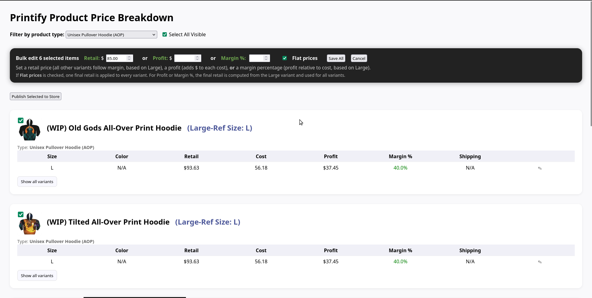
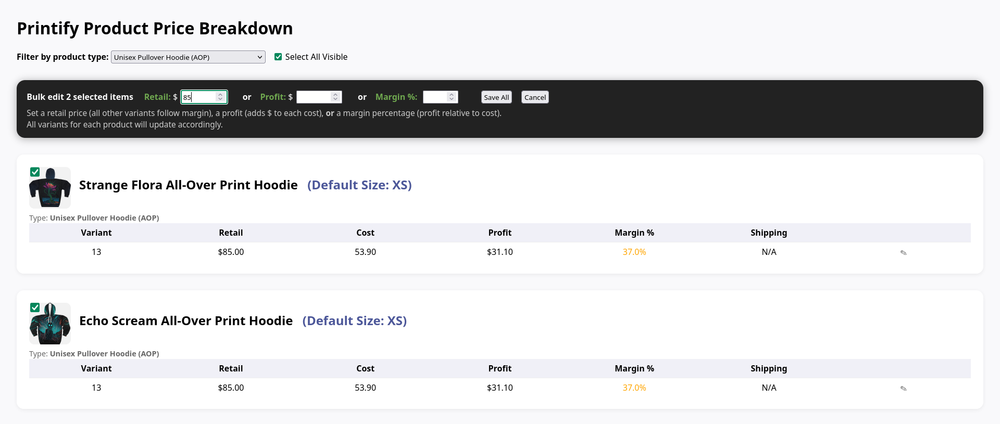

# Printify Product Price Manager



A Flask-based web dashboard for viewing, filtering, and **bulk updating retail prices** of your Printify products with instant feedback, accurate size/color resolution, and live product-type filtering.
Supports flexible pricing modes (retail, margin %, profit, or flat prices) while preserving your product/variant setup in Printify. Designed for efficiency and quick oversight of all your store’s key garments.

---

## Features

* **Automatic detection of garment/product types**
  Filter products by actual types found in your Printify store (e.g., All-Over Print Hoodie, Premium Tee, etc.)

* **Accurate variant resolution**
  Sizes and colors are parsed directly from Printify’s product options by ID, ensuring correct variant labeling across products.

* **Expandable full variant tables**
  Each product card shows a one-line summary (default Large variant), with an expandable section listing all enabled variants, their prices, costs, profit, margins, and shipping.

* **Bulk select and edit**
  Set new **retail**, **profit**, or **margin %** for multiple products at once.

* **One-click product-wide price editing**
  Adjust pricing for all variants of a product in one step, safely preserving all other product settings.

* **Flat Prices option (new!)**
  When enabled in either individual or bulk editors, a single retail price is applied uniformly to all variants.

  * Retail mode: all variants set to the entered retail.
  * Profit/Margin mode: retail is derived from the Large variant, then applied uniformly to all.
  * Profits and margins will differ per variant in this mode since costs vary.

* **Visual profit/margin breakdown**
  Profit and margin % are shown with color-coded indicators (green = healthy margin, orange = medium, red = low).

* **Live sync with Printify**
  No need to manually maintain product lists or blueprints; everything updates from your Printify API data.

* **Responsive, modern UI**
  Clean product cards, filtering, expandable details, and confirmation tables for every update.

---

## Getting Started

### 1. Clone the Repository

```sh
git clone https://github.com/blahpunk/printify-price-manager.git
cd printify-price-manager
```

### 2. Create and Configure Your `.env` File

Copy `.env-sample` to `.env` and set your credentials:

```sh
cp .env-sample .env
```

Open `.env` and set:

* `PRINTIFY_API_KEY` – Your Printify API access token (see below)
* `FLASK_SECRET_KEY` – Any secret string for session encryption (can be random)

Example:

```dotenv
PRINTIFY_API_KEY=your_printify_api_key_here
FLASK_SECRET_KEY=a_really_secret_key
```

---

### 3. Get Your Printify API Key

* Log in to your [Printify account](https://printify.com/)
* Go to **My Account → API tokens** ([API Console](https://printify.com/app/account/api))
* Create a new API token with **read and write** permissions
* Copy the key and paste it as `PRINTIFY_API_KEY` in your `.env` file

---

### 4. Install Requirements

```sh
pip install -r requirements.txt
```

---

### 5. Run the Application

```sh
python app.py
```

Open your browser to [http://localhost:5000](http://localhost:5000).

You’ll see a dashboard showing your products, sizes/colors, profit breakdowns, and editing tools.

---

## Customization

* Product type/category filters are generated dynamically from your actual Printify product data.
* If you want to rename categories, extend the `BLUEPRINT_MAP` dictionary in `app.py`.
* Editors support both **cost-based scaling** and **flat pricing** modes.
* All other UI and logic is in `app.py` and can be adapted as needed.

---

## Security Note

* Never commit your real `.env` with API keys to public repositories.
* This tool is intended for use by Printify store owners/admins only.

---

## Screenshots

### Product Cards with Expandable Variants



---

## License

MIT License (c) 2025
See [LICENSE](LICENSE) for details.

---

## Feedback & Issues

Open a GitHub Issue or contact the maintainer for support or feature requests.
