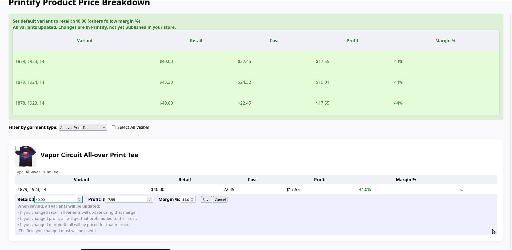

# Printify Product Price Manager



A Flask-based web dashboard for viewing, filtering, and **bulk updating retail prices** of your Printify products with instant feedback and category filtering.  
Supports price updates by retail, margin %, or profit—while preserving your product/variant setup in Printify. Designed for efficiency and quick oversight of all your store’s key garments.

---

## Features

- **Filter products** by garment type (e.g., All-Over Print Hoodie, Art Tee, etc.)
- **Bulk select and edit**: Set new profit, margin %, or retail for multiple products at once
- **One-click price editing** for all variants within a product, safely preserving all other options (no accidental variant changes)
- **Visual profit/margin breakdown** for each product
- **Responsive design** with modern, fast UI

---

## Getting Started

### 1. Clone the Repository

```sh
git clone https://github.com/blahpunk/printify-price-manager.git
cd printify-price-manager
```

### 2. Create and Configure Your `.env` File

Copy `.env-sample` to `.env` and set your credentials:

```sh
cp .env-sample .env
```

Open `.env` and set:

- `PRINTIFY_API_KEY`    *Your Printify API access token (see below)*
- `FLASK_SECRET_KEY`    *Any secret string for session encryption (can be random)*

Example:

```dotenv
PRINTIFY_API_KEY=your_printify_api_key_here
FLASK_SECRET_KEY=a_really_secret_key
```

*If you’re not familiar with `.env` files, they are simple text files containing key-value pairs used for local app settings.  
Never commit your real `.env` file to a public repo.*

---

### 3. Get Your Printify API Key

- Log in to your [Printify account](https://printify.com/)
- Go to **My Account → API tokens** (https://printify.com/app/account/api)
- Create a new API token with read and write permissions
- Copy the key and paste it as `PRINTIFY_API_KEY` in your `.env` file

---

### 4. Install Requirements

```sh
pip install -r requirements.txt
```

---

### 5. Run the Application

```sh
python app.py
```

Open your browser to [http://localhost:5000](http://localhost:5000)  
You’ll see a dashboard showing your products and prices.

---

## Customization

- You can edit `GARMENT_TYPES` in `app.py` to match your own shop’s product lines.
- Default product filtering and other UI logic can be adapted in the same file.

---

## Security Note

- Never commit your real `.env` with API keys to public repositories.
- This tool is intended for use by Printify store owners or admins only.

---

## Screenshots


---

## License

MIT License (c) 2025  
See [LICENSE](LICENSE) for details.

---

### Feedback & Issues

Open a GitHub Issue or contact the maintainer for support or feature requests.
